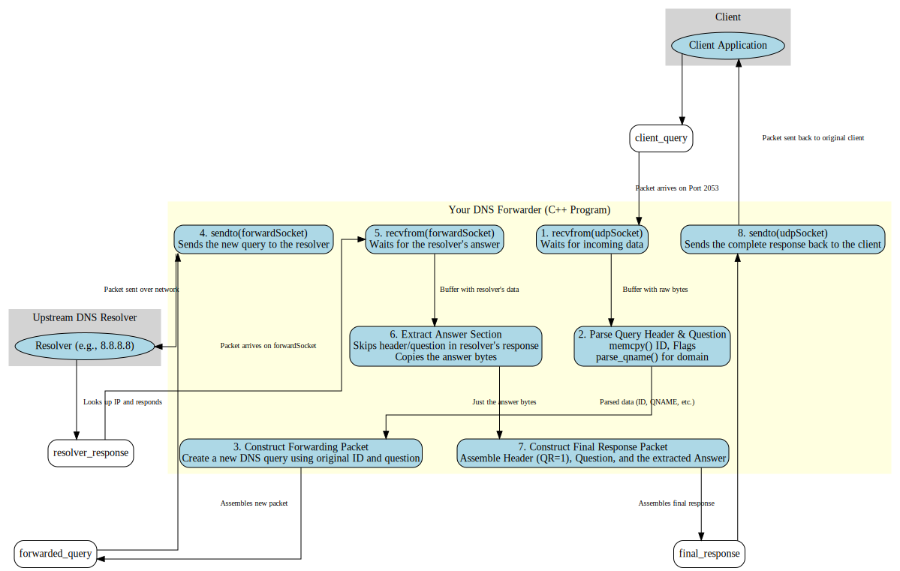
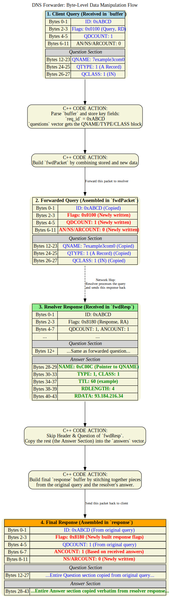

# DNS Server Using the C++

This C++ program implements a basic DNS (Domain Name System) forwarder. It listens for DNS queries on UDP port 2053, forwards them to a specified upstream resolver, and then sends the resolver's response back to the original client.

### How to Compile and Run

1.  **Compilation**: You'll need a C++ compiler (like g++) to build the executable.
    ```bash
    g++ -std=c++11 -o your_server your_program.cpp
    ```

2.  **Execution**: Run the server from your terminal, providing the IP address and port of an upstream DNS resolver.
    ```bash
    ./your_server --resolver <resolver_ip>:<resolver_port>
    ```
    For example, to use Google's public DNS resolver:
    ```bash
    ./your_server --resolver 8.8.8.8:53
    ```
    The server will then start listening for DNS queries on `127.0.0.1:2053`.

### Testing with `dig`

You can use the `dig` command-line tool to test if the server is working correctly.

```bash
dig @127.0.0.1 -p 2053 google.com
```

This command sends a DNS query for `google.com` to your server running on `localhost` at port `2053`.

### Code Breakdown



*   **`main` function**:
    *   **Argument Parsing**: It begins by checking for the correct command-line arguments. The server expects a `--resolver` flag followed by the resolver's IP address and port.
    *   **Socket Creation**: Two UDP sockets are created:
        *   `udpSocket`: Listens for incoming queries from clients on port 2053.
        *   `forwardSocket`: Used to forward the DNS queries to the upstream resolver.
    *   **Binding**: The `udpSocket` is bound to `0.0.0.0:2053`, allowing it to accept connections from any network interface.
    *   **Main Loop (`while(true)`)**: The server enters an infinite loop to continuously receive and process DNS queries.
        *   **`recvfrom`**: It waits for a DNS query to arrive on `udpSocket`.
        *   **DNS Message Parsing**:
            *   **Header**: It parses the header of the DNS query to extract the request ID and flags.
            *   **Questions**: It iterates through the question section of the DNS query to extract the domain name (`qname`), query type (`qtype`), and query class (`qclass`). The `parse_qname` function is used to correctly handle the domain name, which might use message compression.
        *   **Forwarding Logic**:
            *   For each question in the original query, it constructs a new DNS query packet.
            *   This new packet is then sent to the upstream resolver using `forwardSocket`.
        *   **Receiving from Resolver**: It waits for a response from the upstream resolver using `recvfrom`.
        *   **Response Construction**: It constructs a new DNS response packet to send back to the client. This response includes:
            *   The original request ID.
            *   Response flags indicating success or failure.
            *   The original question(s).
            *   The answer(s) received from the upstream resolver.
        *   **`sendto`**: The final response is sent back to the client who made the initial request.

*   **`parse_qname` function**:
    *   This helper function is responsible for parsing the domain name from the question section of a DNS query.
    *   DNS queries use a specific format for domain names, where labels (like "google" and "com") are prefixed by their length. For example, "google.com" is encoded as `6google3com0`.
    *   This function also handles DNS message compression, where a domain name can use a pointer to a previous occurrence of the same name to save space.
 
### Bit Manipulation


